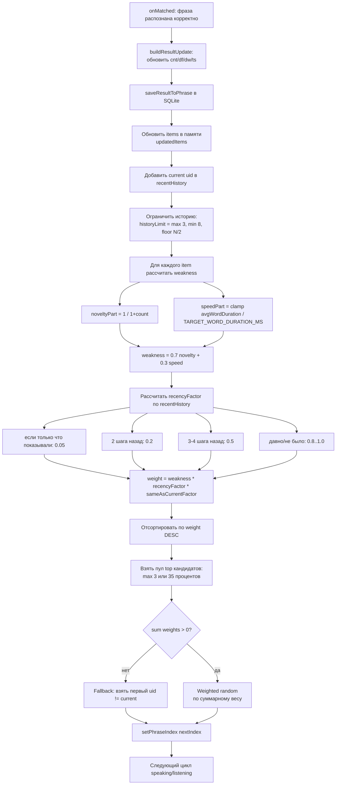

# Адаптивный выбор следующей фразы — блок-схема (Mermaid)

Ниже показан алгоритм, который сейчас используется после корректного ответа для выбора **следующей** фразы:

- приоритет «слабо изученным» элементам;
- штраф за недавние повторы;
- выбор не строго детерминированный, а взвешенно-случайный.

## Коротко о поведении

1. **Слабые элементы** получают более высокий шанс за счёт низкого `count` и медленной скорости ответа.
2. **Недавние элементы** штрафуются, чтобы не повторяться подряд.
3. Выбор делается из **топ-пула**, что удерживает фокус на проблемных фразах, но оставляет вариативность.
