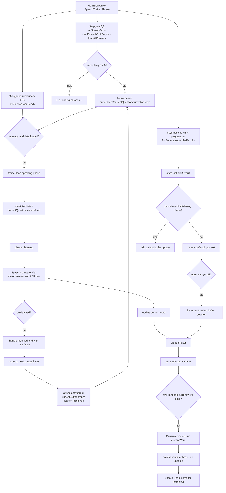

# SpeechTrainerPhrase.tsx — блок-схема и зоны декомпозиции

Ниже блок-схема текущей логики компонента `SpeechTrainerPhrase.tsx` в формате Mermaid.

## Блок-схема

## Ключевые подсистемы внутри компонента

1. **Инициализация данных** (SQLite init/seed/load).
2. **Управление циклом тренировки** (`phase`, `phraseIndex`, `speakAndListen`).
3. **Обработка ASR событий** (подписка, буферизация partial, нормализация).
4. **Сопоставление эталона и ответа** через `SpeechCompare`.
5. **Менеджмент вариантов слов** (`VariantPicker`, сохранение в DB и локальный state).
6. **UI-обвязка страницы** (`Toolbar`, `Settings`, статусы фаз).

## Почему декомпозиция выглядит целесообразной

Компонент уже объединяет несколько независимых контекстов ответственности (данные, оркестрация speech-пайплайна, ASR-аналитика, persistence, UI). Для упрощения сопровождения имеет смысл выделить:

- `useTrainerSession` — управление `phase`, `phraseIndex`, переходами шага.
- `usePhraseData` — загрузка/refresh фраз и операции сохранения variants.
- `useAsrVariantsBuffer` — подписка на ASR, нормализация и статистика partial.
- `SpeechTrainerHeader` / `TrainerStatus` — изоляция UI-слоя от бизнес-логики.

Это снизит связность, упростит unit-тестирование и ускорит эволюцию логики (например, добавление второго ASR-движка или новых режимов тренировки).
